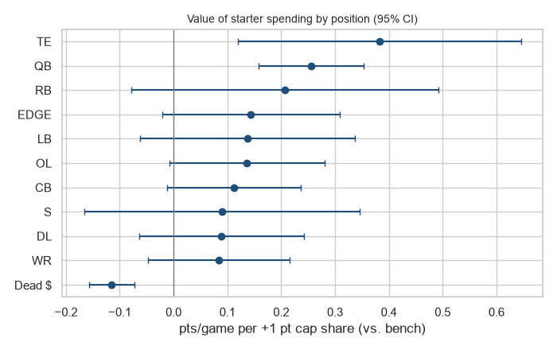
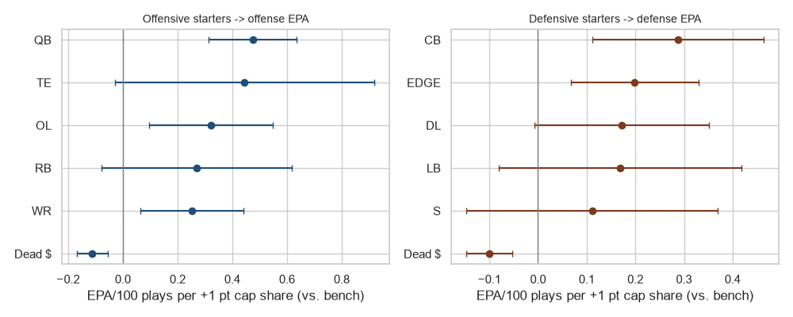
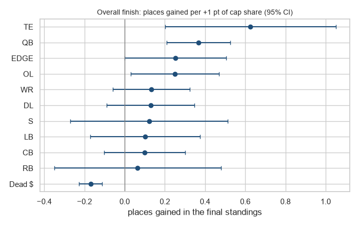
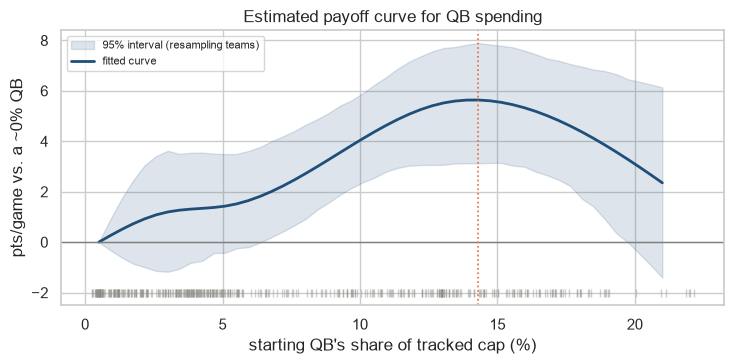

# Which NFL positions are worth paying for?

A team-level look at salary cap spending and results across 13 seasons (2013 to 2025). The interactive dashboard is at https://nfl-position-value.vercel.app. Every number below comes from the same models the dashboard shows.

## The short version

Spending on the starting quarterback has the clearest payoff in this data, and it works through the passing game. Receivers and offensive linemen help the offense, and edge rushers and cornerbacks help the defense, each on the side of the ball where they play. Tight end looks valuable at first, but a simple check says that result is probably noise. Taken together, how a team splits its cap explains about 16% of how it performs.

The strongest single marker is not a position at all: teams carrying a lot of dead money and unspent cap do worse. That is probably as much a result of a bad year as a cause of one.

## The question

Every team splits a salary cap across positions, and the cap has grown a lot over this period (the average team's tracked cap rose from about $107M to $228M). Where is the next dollar worth the most? People argue about it all the time, usually with a handful of memorable examples. I wanted to check it against every team and season I could get.

## What I did

I combined public nflverse data into 416 team-seasons (32 teams, 2013 to 2025): contract cap hits from Over the Cap, snap counts, game results, play-by-play EPA and weekly roster status.

- **Cap share.** Each position group's cap hit as a share of the team's total, so a 2013 season can be compared with a 2025 one. One point of share is about $1.6M for an average team.
- **Starters and bench.** Money on a starting left tackle and money on a backup are different decisions. I counted the top players at each position by snaps as starters (QB1, RB1, three WR, TE1, five OL, and so on, filling a standard 11-man lineup) and everyone else as bench.
- **Results.** Four outcomes: point differential per game, offensive EPA per play, defensive EPA per play (which separate the two sides of the ball), and overall finish in the final standings, rebuilt from the league's draft order so that it includes the playoffs.
- **Dead money and unspent cap.** The contract data has no dead cap, because a released player's leftover bonus is not in his season history. I recovered it as the league's base cap minus every tracked cap hit. It is mostly dead money but also includes cap a team left unused, and I cannot separate the two.
- **One model for all positions.** A single regression with every position and dead money at once, season fixed effects, and standard errors clustered by team. Each coefficient answers one question: what happens if one point of cap moves from bench depth into this position's starters?

## What I found

### Quarterback is the clearest payoff

Moving one point of cap share into the starting QB is associated with about +0.26 points per game (95% interval +0.16 to +0.35). In EPA terms the effect is mostly passing (+0.71 per 100 plays on pass offense, against +0.12 on the run game) and nothing on defense.

I worried about two things. Cheap rookie-contract QBs are a big group (44% of team-seasons), and if they happened to be worse, QB spending would only be standing in for age. Adding a rookie-contract control moved the QB coefficient from 0.255 to 0.248. I also reran the result under six different definitions of "starter", and the QB effect held under all six.

### Spending lines up with where the work happens

Splitting results into offense and defense, spending on offensive starters shows up in offensive EPA and spending on defensive starters shows up in defensive EPA. Receivers (+0.25, through the passing game) and offensive linemen (+0.32, through both passing and running) help the offense. Edge rushers (+0.20) and cornerbacks (+0.29) help the defense through pass defense, and interior linemen point the same way against the run (+0.17, just short of significant). Safeties and linebackers show no clear effect. All figures are EPA per 100 plays for one point of cap share.

On point differential alone, the line, edge and corner results are weaker (their intervals just touch zero). Splitting by side of the ball is what shows them, which is why I put weight on the pattern and not on any one number.

### The tight end result that was not real

Tight end had the largest estimate in the first model, and it was stable across starter definitions. Then I ran a placebo check. Spending on offensive positions should not move the defense, and spending on defensive positions should not move the offense. Every position passed except one. Tight end spending "improved" the defense (+0.37, p = 0.020) about as much as it improved the offense. A tight end cannot cause that. I treat the original result as noise, or as a stand-in for something I did not measure. Stability across definitions did not save it, because the same quirk was present in every version.

### Overall finish tells the same story

Point differential ignores the playoffs, so I added a fourth outcome: where a team ended the season among the 32 teams. The league's own first-round draft order encodes this (champion last, then the other playoff teams by the round they lost, then everyone else by record), so I rebuilt each team's original pre-trade slot from the standings and flipped it so 1 is the champion. I checked the rebuilt slots against the real drafts and the trades table: 93% (388 of 416) could be verified, and the rest are mostly exact ties or recent trades missing from the data.

Results are shown as places gained per point of cap share. QB again leads (+0.37 places, interval +0.21 to +0.53), with offensive line (+0.25) and edge rusher (+0.25, borderline) behind it. Tight end is again the largest estimate (+0.63) and again the one that fails the placebo check, and dead money again goes with fewer places.

### QB spending tapers off

The payoff per extra dollar falls as a QB's share of the cap rises. A curve fitted to the data peaks near 14% of the cap (roughly $30M to $35M at today's levels) and eases afterward. The top tier includes superstar seasons and big misses: 42% of the 59 team-seasons above 15% of the cap had a negative point differential. Whether returns actually turn negative at the top is not established, because the interval on the drop includes zero.

### Most "wasted" bench money was injuries

Early on, money tied up in non-starting QBs and linemen looked wasteful, since it went with worse results. Splitting it by why the player was not a starter changed the story. Most of it was injured-reserve money. A one-standard-deviation increase in injured-reserve cap share costs about 1.2 points per game in the same season, but last season's injured-reserve money does not predict this season's results. That pattern fits an injury that hurt one team in one year. A badly built roster would carry over.

### Do better backup quarterbacks cushion the blow?

Losing the starting QB for eight weeks costs about five points per game. I tested whether a better backup softens that, measuring "better" several ways: cap hit, performance before the season (which I checked does predict next-year performance), experience and draft position. I also looked at the QB who actually replaced the starter, because the planned backup played only 53% of the time. The best estimate is that a replacement one standard deviation better recovers about a fifth of the damage, which is close to what the arithmetic predicts. The data cannot tell that from zero, and they cannot rule out a benefit of up to about two-fifths.

### Dead money and unspent cap: the strongest marker, and probably not a cause

Each extra point of cap share in dead money and unspent cap goes with about 0.12 fewer points per game, 0.11 less offensive EPA, 0.10 less defensive EPA and 0.17 fewer places in the final standings. All four are significant under all six starter definitions. It hurts offense and defense about equally, so it behaves like a team-wide signal, not a position effect. Including it lifts the model's explanatory power for point differential from about 10% to 16%.

It also changes the position results. Part of what looked like a position effect was this: without it QB was +0.31 points per game and with it +0.26 (still clearly positive), and WR, OL, EDGE and CB drop below the 5% line on point differential. Their side-specific results hold up, and tight end still fails the placebo check. I kept dead money in the model throughout because leaving it out lets the positions pick up part of its effect.

I would not read this as dead money costing wins. Last season's dead money does not predict this season's results, only the same season's does. That fits teams that fall out of contention cutting players and leaving cap unspent, as much as it fits a poorly built roster. It is a good marker of a struggling team, and I cannot tell whether it is a cause.

## The dashboard

The page lets you test these claims yourself. The effects chart shows every estimate with its interval, and a toggle switches among the four outcomes. The position explorer plots any position's spending against any outcome, with a team highlight and a season range. The team explorer shows one team's results by season (also switchable among the four outcomes) above a grid of where its money sat against the league average that year. Dead money and unspent cap appears as an extra row in each. There is a light and a dark theme, and on a phone the team explorer opens on the last eight seasons so the grid stays readable.

## What I would be careful about

- **Association, not causation.** Teams choose where to spend, and good teams may pay stars because they are good.
- **Cap hit is an accounting number.** Restructures and late-contract spikes inflate it, so it is an imperfect measure of what a player costs.
- **Partial coverage.** The cap data covers part of the official cap, so I use shares. The dead-money measure is the leftover, so it also absorbs unspent cap and each team's carryover, and it relies on the base cap figures I typed in.
- **Small samples at the edges.** There are 59 team-seasons at the top of QB spending and about 76 seasons where the starter missed four or more weeks.
- **Many comparisons.** Eleven rows across several outcomes means a few significant results are expected by chance. The pattern across results is what gives me confidence, more than any single p-value.

## How I checked myself

- Reran the key findings under six definitions of "starter".
- Rebuilt each team's pre-trade draft slot from the standings and checked it against the real drafts and trades (93% verified) before using it as an outcome.
- Split the sample at 2019 to see whether a point of cap share means the same thing as the cap grew. The position effects held (QB +0.28 and +0.26 points per game in the two halves); only dead money weakened.
- Checked that last season's dead money does not predict this season, which kept me from reading it as a cause.
- Controlled for rookie-scale contracts.
- Added the offense-versus-defense placebo test, which is what caught the tight end result.
- Used last season's values to separate injury effects from roster quality.
- Recalibrated my QB quality measure after finding that replacements played worse than it predicted.
- Caught two of my own bugs by comparing against numbers I already trusted: a units mix-up that briefly made a QB rating correlate negatively with results, and a chart whose labels had been overwritten.

## Built with

Python (pandas, statsmodels) in a Jupyter notebook. The dashboard is a single HTML file with hand-built SVG charts, generated from the same models and deployed on Vercel. The type is Barlow Condensed and IBM Plex.

*Code and notebook: [link to add when the repository is public].*
